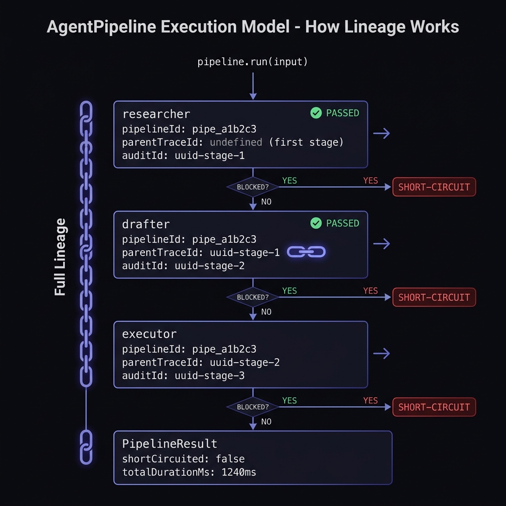

# AgentTrace 🛡️

> **"Agent 1 made an error. Agent 2 built on it. Agent 3 executed it. All three returned status 200. Nobody knew."**

[](https://www.npmjs.com/package/@hackerx333/agenttrace)
[](https://pypi.org/project/ai-agenttrace/)
[](https://opensource.org/licenses/MIT)

**The open-source circuit breaker for multi-agent AI pipelines.**

Trace every action. Explain every decision. Short-circuit before the damage propagates.

---

## The Problem: AI Pipelines Have No Circuit Breaker

Multi-agent AI systems fail silently. A single hallucination in Agent 1 propagates downstream with *increasing confidence* until Agent 3 takes an irreversible action.


This is not a hypothetical. It is happening in production right now.

Single-agent tracing exists. Error isolation between agents does not. Electrical grids solved this problem in 1913 with circuit breakers. AI pipelines in 2025 haven't.


AgentTrace is the circuit breaker layer your AI pipeline is missing.

- 🟢 **Wraps every agent individually** — catches violations at the source
- 🟢 **Shared pipeline context** — one `pipelineId` across all agents, full lineage
- 🟢 **Short-circuits on first violation** — downstream agents never run
- 🟢 **Plain-English explanations** — compliance officers can read every decision
- 🟢 **Full audit trail** — local NDJSON, zero cloud dependency

---

## Quick Start

### TypeScript / Node.js

```bash
npm install @hackerx333/agenttrace
```

**Single agent:**

```typescript
import { AgentTrace } from '@hackerx333/agenttrace';

const guard = new AgentTrace({
  enforcementMode: 'enforce',
  rules: ['block_hallucination', 'block_pii_leakage', 'require_human_approval'],
  explain: true,
});

const safeAgent = guard.wrap(myAgent);
const result = await safeAgent.run('Summarise this customer file');

// result.blocked    → false
// result.riskLevel  → 'LOW'
// result.explanation → "Agent summarised the file. No PII detected. Risk: LOW."
```

**Multi-agent pipeline (circuit breaker):**

```typescript
import { AgentTrace, AgentPipeline } from '@hackerx333/agenttrace';

// Each agent gets its own rules
const researchGuard = new AgentTrace({ rules: ['block_hallucination'], explain: true });
const drafterGuard  = new AgentTrace({ rules: ['block_pii_leakage'],   explain: true });
const executorGuard = new AgentTrace({ rules: ['require_human_approval'], explain: true });

const pipeline = new AgentPipeline({
  name: 'customer-support-pipeline',
  agents: [
    { name: 'researcher', guard: researchGuard, agent: researchAgent },
    { name: 'drafter',    guard: drafterGuard,  agent: drafterAgent  },
    { name: 'executor',   guard: executorGuard, agent: executorAgent },
  ],
});

const result = await pipeline.run(userInput);

// If Agent 1 hallucinates:
// result.shortCircuited  → true
// result.blockedAt       → 'researcher'
// result.stages[0].blocked → true
// result.stages[1]         → undefined  (never ran)

// Full lineage:
// result.pipelineId      → "pipe_a1b2c3"
// result.stages[0].parentTraceId → undefined  (first agent)
// result.stages[1].parentTraceId → result.stages[0].auditId
```

### Python

```bash
pip install ai-agenttrace
```

```python
from agenttrace import AgentTrace, AgentTraceOptions

guard = AgentTrace(AgentTraceOptions(
    enforcementMode='shadow',
    rules=["block_hallucination", "block_pii_leakage"],
    explain=True,
))

safe_agent = guard.wrap(my_crewai_agent)
result = await safe_agent.invoke("Process customer request")

print(result.blocked)      # True/False
print(result.risk_level)   # 'LOW' | 'MEDIUM' | 'HIGH' | 'CRITICAL'
print(result.explanation)  # "Agent accessed non-sensitive records securely."
```

---

## Multi-Agent Pipeline: How It Works

The `AgentPipeline` class is the circuit breaker layer. Every stage shares a `pipelineId`. Each stage's `parentTraceId` links to the previous stage's `auditId`, creating a cryptographic lineage chain you can query.



Every stage in a pipeline writes to the same `.agenttrace/traces.ndjson` file with the shared `pipelineId`. The dashboard can reconstruct the full lineage — and the moment something goes wrong, you know exactly which stage caused it, why, and which downstream agents were stopped.

---

## The Dashboard

AgentTrace ships with a local React dashboard. Launch it from your project root:

```bash
npx agenttrace ui
```

**Pipeline View:** See every pipeline run as a connected flow. Red stage = blocked (short-circuit point). Green = passed. Click any stage to inspect the individual trace, violations, and explanation.

**Trace View:** Full multi-step audit trail per agent run — risk distribution, action status, violations, plain-English explanation.

*The dashboard reads `.agenttrace/traces.ndjson`. Both TypeScript and Python SDKs write to the same file — works in polyglot monorepos.*

---

## Enforcement Modes

```typescript
// enforce (default): blocks the output when a rule fires
const guard = new AgentTrace({ enforcementMode: 'enforce', rules: [...] });

// shadow: detects and logs violations but lets the agent output through
// Use this to audit production before enforcing
const guard = new AgentTrace({ enforcementMode: 'shadow', rules: [...] });
```

Shadow mode is the safe way to deploy to production. Run it for a week, see what it catches, then flip to `enforce`.

---

## Built-in Rules

AgentTrace ships with 13 built-in rules. All rules run **in parallel** — zero serial latency on the happy path.

| Rule | Category | What it blocks | Severity |
|------|----------|---------------|----------|
| `block_pii_leakage` | **Privacy** | Emails, phones, SSNs, credit cards, Aadhaar, API keys | HIGH–CRITICAL |
| `block_special_category_data` | **Privacy** | GDPR Art 9: health, genetics, sexual orientation, political views | HIGH–CRITICAL |
| `block_manipulation` | **EU AI Act** | Art 5 prohibited practices: artificial urgency, dark patterns, gaslighting | HIGH–CRITICAL |
| `block_discriminatory_output` | **Fairness** | EU Charter Art 21: bias on race, gender, age, religion, nationality, disability | CRITICAL |
| `block_ai_identity_deception` | **Transparency** | EU AI Act Art 50: agents claiming to be human or denying being AI | CRITICAL |
| `block_medical_advice` | **Professional** | Unqualified diagnosis, treatment recommendations, dosage instructions | CRITICAL |
| `block_legal_advice` | **Professional** | Unauthorized Practice of Law (UPL): specific legal strategy advice | HIGH |
| `block_financial_advice` | **Professional** | Investment recommendations, guaranteed returns, loan guidance | HIGH |
| `block_prompt_injection` | **Security** | OWASP LLM01: instruction overrides, persona hijacking, data exfiltration | CRITICAL |
| `block_system_prompt_leakage` | **Security** | OWASP LLM07: agent exposing internal configuration or instructions | HIGH |
| `block_harmful_content` | **Safety** | Violence, illegal instructions, self-harm, hate speech | HIGH–CRITICAL |
| `require_human_approval` | **Oversight** | Actions above a $ threshold, irreversible/destructive operations | HIGH–CRITICAL |
| `block_hallucination` | **Quality** | Factual claims not supported by your RAG context documents | HIGH |

Use pre-configured compliance bundles:

```typescript
import { COMPLIANCE_BUNDLES } from '@hackerx333/agenttrace';

const guard = new AgentTrace({ rules: COMPLIANCE_BUNDLES.EU_AI_ACT });
// or
const guard = new AgentTrace({ rules: COMPLIANCE_BUNDLES.OWASP_LLM });
```

---

## Custom Rules

Write your own rules in 5 lines:

```typescript
import { createRule, AgentTrace } from '@hackerx333/agenttrace';

const noCompetitorMentions = createRule(
  'no_competitor_mentions',
  async ({ result }) => {
    const text = JSON.stringify(result);
    if (text.toLowerCase().includes('rival-corp')) {
      return [{ rule: 'no_competitor_mentions', description: 'Competitor mentioned', severity: 'MEDIUM' }];
    }
    return [];
  }
);

const guard = new AgentTrace({ rules: [noCompetitorMentions, 'block_pii_leakage'] });
```

---

## Global Configuration

Drop an `agenttrace.config.json` in your project root. The SDK auto-resolves it:

```json
{
  "enforcementMode": "enforce",
  "rules": ["block_pii_leakage", "block_hallucination"],
  "explain": true,
  "storagePath": ".agenttrace/traces.ndjson"
}
```

---

## Audit Trail

Every agent run is automatically persisted to a local NDJSON file. No cloud. No data leaves your machine.

```typescript
// Query the audit trail
const recent  = guard.storage?.getRecent(20);
const blocked = guard.storage?.getBlocked();
const stats   = guard.storage?.stats();
// → { total: 142, blocked: 3, byRiskLevel: { LOW: 138, HIGH: 3, CRITICAL: 1 } }

const run = guard.storage?.getById('audit-uuid-here');
```

Storage location:
```
.agenttrace/
└── traces.ndjson   ← all audit trails, append-only
```

---

## Works With

| Framework | How |
|-----------|-----|
| ✅ **LangChain / LangGraph** | `guard.wrap(chain)` — intercepts `.invoke()` and `.run()` |
| ✅ **CrewAI** | `guard.wrap(crew)` — intercepts `.kickoff()` |
| ✅ **OpenAI Assistants** | `guard.guardFn(async () => openai.beta.threads.runs.create(...))` |
| ✅ **Anthropic** | `guard.wrap(agent)` — intercepts tool use agents |
| ✅ **Any async function** | `guard.guardFn(async () => myFn(input), input)` |

---

## AI Explainer Engine

Set `explain: true` and add an API key to get plain-English explanations for every decision — blocked or allowed:

```
✅ ALLOWED — Risk: LOW
Agent processed a $50 refund for customer #12345 because:
(1) The purchase was within the 30-day return window.
(2) The amount was below the $100 automatic-approval threshold.
(3) No PII was exposed. No violations detected.
Confidence: HIGH.

⛔ BLOCKED — Risk: CRITICAL
Agent action blocked. Violated rule(s): block_hallucination.
The agent stated "The FDA approved this drug in 2019" but no supporting
evidence was found in the provided context documents.
```

Supports: Anthropic Claude, OpenAI, Featherless AI (any OpenAI-compatible endpoint).

No API key? Falls back gracefully to a canned message. **AgentTrace never crashes because of a missing key.**

---

## Architecture

```
Your Agent (or Pipeline)
         │
         ▼ (Proxy intercept)
┌─────────────────────────────────────────────┐
│                AgentTrace                   │
│                                             │
│  ┌─────────┐  ┌─────────────────────────┐   │
│  │  Tracer │  │    Rule Engine          │   │
│  │         │  │   (runs in parallel)    │   │
│  │ Step 1  │  │  • block_hallucination  │   │
│  │ Step 2  │  │  • block_pii            │   │
│  │ Step 3  │  │  • block_financial      │   │
│  └─────────┘  │  • human_approval       │   │
│               │  • custom rules...      │   │
│               └─────────────────────────┘   │
│                                             │
│  ┌──────────────┐  ┌────────────────────┐   │
│  │   Explainer  │  │      Store         │   │
│  │  (Anthropic  │  │  (NDJSON, local)   │   │
│  │  / OpenAI)   │  │  pipelineId linked │   │
│  └──────────────┘  └────────────────────┘   │
└─────────────────────────────────────────────┘
         │
         ▼
GuardedResult {
  blocked, reason, explanation,
  riskLevel, auditId, auditTrail,
  violations, result,
  pipelineId?,      ← present when run inside AgentPipeline
  parentTraceId?,   ← links to the previous agent's auditId
}
```

---

## Self-Hosted, Free Forever

AgentTrace stores everything locally. Zero cloud dependency. Zero data leaves your machine.

```
.agenttrace/
└── traces.ndjson   ← append-only audit trail
```

---

## Cloud Dashboard (Coming Soon)

- Real-time pipeline monitoring
- Team access and alerts
- Compliance reports (EU AI Act, SOC2)
- 1-year retention with full-text search

→ [Join the waitlist](https://github.com/kalash33/agenttrace)

---

## FAQ

**Q: Does this add latency?**  
A: Rules run in parallel. Happy path overhead is typically <5ms. Explanation generation (optional) adds ~500–800ms via the LLM API.

**Q: What if my agent isn't an object with a `.run()` method?**  
A: Use `guard.guardFn(async () => myFn(input), input)`. Works with any async function.

**Q: Can I use this without an API key?**  
A: Yes. All 13 rules work without any API key. `explain: true` requires a key but falls back gracefully.

**Q: What's the difference between AgentTrace and guardrails libraries?**  
A: Guardrails prevent bad outputs for a single agent. AgentTrace is an accountability layer for the entire pipeline — it traces, explains, and short-circuits across multiple connected agents. It also generates a full audit trail for compliance, not just blocks.

**Q: Is the audit trail tamper-proof?**  
A: Currently it's append-only NDJSON. Cryptographic hash-chain signing is on the roadmap.

**Q: Does AgentPipeline work with Python?**  
A: The TypeScript SDK has full `AgentPipeline` support now. Python parity is in progress.

---

## Contributing

PRs welcome! Key areas:

- New built-in rules (domain-specific compliance)
- Agent framework integrations (AutoGen, Semantic Kernel, Haystack)
- Better hallucination detection (semantic similarity, vector search)
- Python `AgentPipeline` parity
- Cloud dashboard
- Hash-chain audit trail (tamper-proof)

See [CONTRIBUTING.md](./CONTRIBUTING.md) for guidelines.

---

## How AgentTrace Actually Solves This Problem

> **"Agent 1 made an error. Agent 2 built on it. Agent 3 executed it. All three returned status 200. Nobody knew."**

Let's be specific about exactly what is broken and exactly how AgentTrace fixes it.

### The failure mode, decomposed

| What happens | Why it's invisible today |
|---|---|
| Agent 1 hallucinates a fact | Returns `{status: 200, result: "..."}`  — no error code, no flag |
| Agent 2 receives hallucinated output as ground truth | It has no way to know the upstream agent was wrong |
| Agent 3 takes an irreversible action based on compounded error | Also returns 200. The damage is done. |
| Post-mortem is impossible | No shared trace ID, no lineage, no way to reconstruct which agent caused what |

This is exactly what nocapvc described: *"A single hallucination in Agent 1 propagates through every downstream agent with increasing confidence."*

### What AgentTrace does, concretely

**1. Wraps each agent with an enforcement layer before output leaves**  
The Proxy intercepts `.run()` / `.invoke()` / `.execute()` before the caller sees the result. The rule engine runs *on the output*. The caller never receives hallucinated, PII-leaking, or harmful content — it receives a `GuardedResult` with `blocked: true` and full violation details.

**2. Connects agents into a pipeline with a shared `pipelineId`**  
Every stage receives the same `pipelineId`. Each stage's trace knows who ran before it (`parentTraceId`). This creates an immutable lineage graph. When something goes wrong, you can see the exact propagation path.

**3. Short-circuits on first violation — downstream agents never run**  
This is the circuit breaker. The moment Agent 1 is blocked, `pipeline.run()` returns immediately. Agents 2 and 3 receive no input, produce no output, take no action. The damage cannot propagate because there is nothing to propagate to.

**4. Generates a plain-English audit trail every compliance officer can read**  
Not just `blocked: true`. A full explanation: *which rule fired, what evidence triggered it, what the agent was attempting to do, and what was stopped.* Every decision is documented. Not just the bad ones.

**5. Writes everything locally — zero cloud dependency**  
Your agent outputs never leave your machine. The audit trail is append-only NDJSON. The dashboard reads it locally. There is no SaaS to trust.

### The direct mapping to the thesis

| Thesis claim | AgentTrace mechanism |
|---|---|
| *"Agent 1 made an error"* | `block_hallucination` / `block_pii_leakage` intercepts it **before output leaves Agent 1** |
| *"Agent 2 built on it"* | Pipeline short-circuit prevents Agent 2 from ever receiving Agent 1's output |
| *"Agent 3 executed it"* | Agent 3 is never invoked. `result.stages[2]` is `undefined`. |
| *"All three returned 200"* | Only Agent 1 runs. `result.shortCircuited = true`, `result.blockedAt = 'researcher'` |
| *"Nobody knew"* | Full audit trail: `pipelineId`, `parentTraceId` chain, violation details, plain-English reason — all queryable |

### Why "Accountability" and not "Guardrails"?

> "Intelligence may be scalable, but accountability is not." — Accenture/Wharton, 2026

Guardrails prevent bad outputs for a *single* agent. Accountability is a cross-agent principle. AgentTrace traces, explains, and short-circuits across the entire pipeline — and generates a chain of evidence that stands up to audit. **Not just the bad ones. Across the entire pipeline.**

---

## License

MIT © 2026 AgentTrace Contributors
