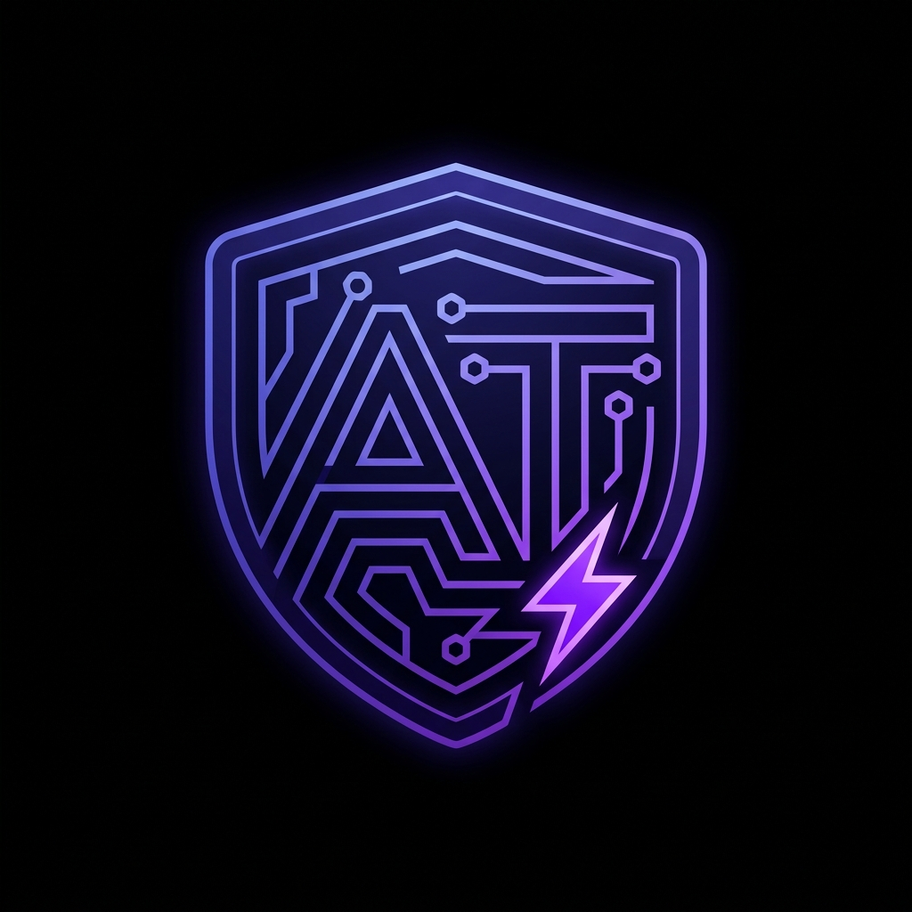
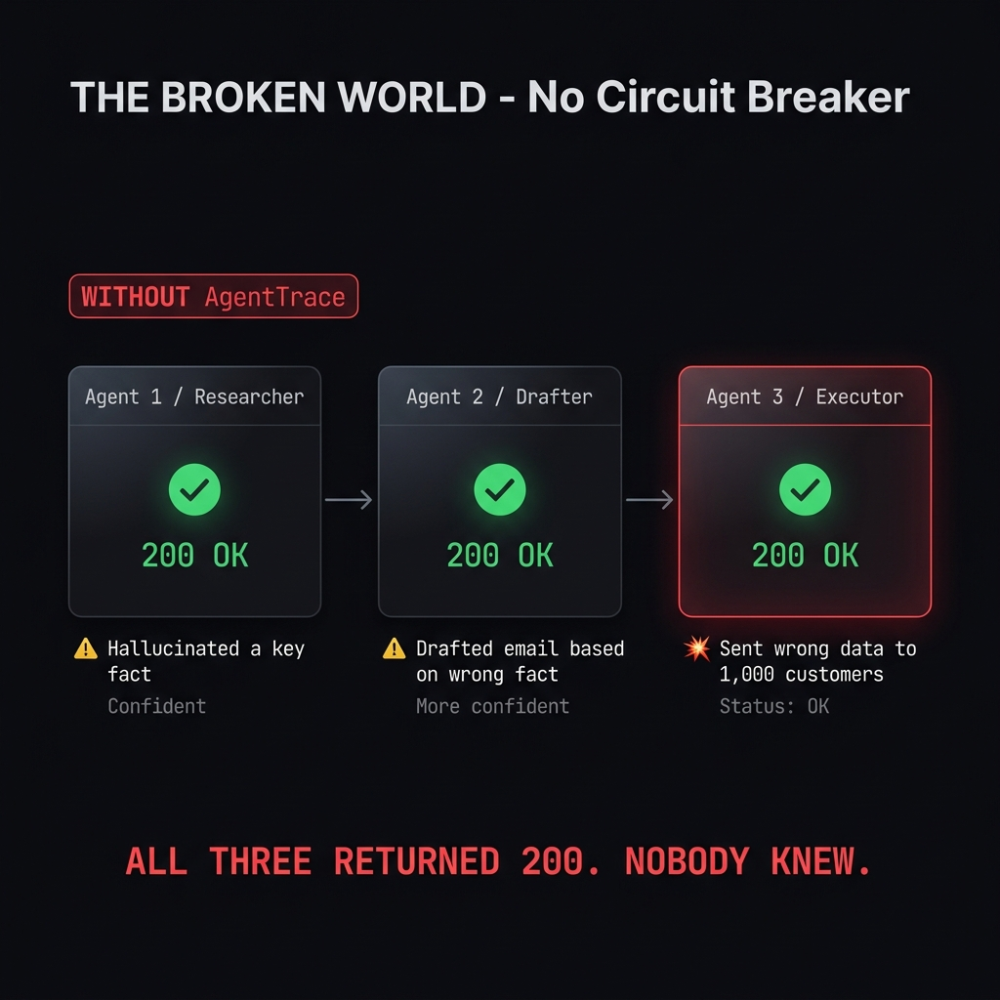
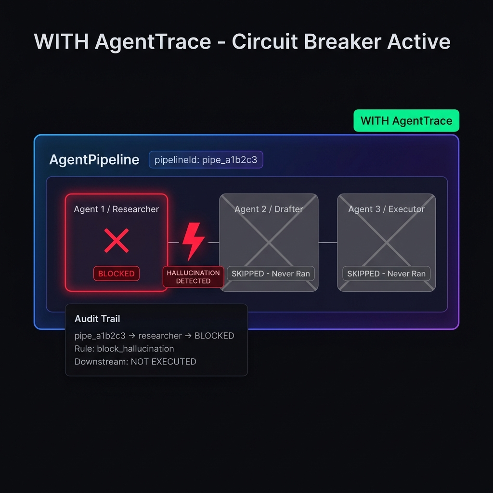

<p align="center">
  
</p>

# AgentTrace 🛡️

> **"Agent 1 made an error. Agent 2 built on it. Agent 3 executed it. All three returned status 200. Nobody knew."**

[](https://www.npmjs.com/package/@hackerx333/agenttrace)
[](https://pypi.org/project/ai-agenttrace/)
[](https://opensource.org/licenses/MIT)
[](#)
[](#)
[](#)

**The open-source circuit breaker and accountability layer for multi-agent AI pipelines.**

Trace every action. Explain every decision. Short-circuit before the damage propagates.

```
npm install @hackerx333/agenttrace
```

---

## The Problem: AI Pipelines Have No Circuit Breaker

Multi-agent AI systems fail **silently**. A single hallucination in Agent 1 propagates downstream with *increasing confidence* until Agent 3 takes an irreversible action — and all three return HTTP 200.



This is not a hypothetical. It is happening in production right now.

Single-agent tracing exists. Error isolation between agents does not. Electrical grids solved this problem in 1913 with circuit breakers. AI pipelines in 2025 haven't.



AgentTrace is the circuit breaker layer your AI pipeline is missing.

| | Without AgentTrace | With AgentTrace |
|---|---|---|
| Agent 1 hallucinates | Returns `200 OK` | ⛔ BLOCKED — `riskLevel: CRITICAL` |
| Agent 2 receives bad data | Builds on it | 🛑 **Never runs** |
| Agent 3 takes action | Irreversible damage | 🛑 **Never runs** |
| Post-mortem | Impossible | Full audit trail with lineage chain |

---

## Quick Start

### TypeScript / Node.js

```bash
npm install @hackerx333/agenttrace
```

**Wrap a single agent:**

```typescript
import { AgentTrace } from '@hackerx333/agenttrace';

const guard = new AgentTrace({
  rules: ['block_hallucination', 'block_pii_leakage', 'block_prompt_injection'],
  context: ['Company policy: refunds up to $200. No exceptions.'], // for hallucination check
  enforcementMode: 'enforce',
  explain: true,
});

const safeAgent = guard.wrap(myAgent);
const result = await safeAgent.run('Process this customer refund request');

if (result.blocked) {
  console.log(result.reason);       // "AGENT ACTION BLOCKED — Violated: block_hallucination"
  console.log(result.violations);   // [{ rule, severity, description, evidence }]
} else {
  console.log(result.result);       // agent's output — safe to use
  console.log(result.explanation);  // "Agent processed refund. No violations. Risk: LOW."
}
```

**Or use `guardFn` for any async function:**

```typescript
const result = await guard.guardFn(
  async () => await myApiCall(input),
  'api_call'  // action label for the audit trail
);
```

**Multi-agent pipeline with circuit breaker:**

```typescript
import { AgentTrace, AgentPipeline } from '@hackerx333/agenttrace';

const pipeline = new AgentPipeline({
  name: 'medical-decision-support',
  agents: [
    {
      name: 'data-researcher',
      guard: new AgentTrace({
        rules: ['block_hallucination'],
        context: ['Metformin max dose: 2000mg/day per FDA guidelines.'],
      }),
      agent: researchAgent,
    },
    {
      name: 'prescription-drafter',
      guard: new AgentTrace({ rules: ['block_medical_advice', 'block_pii_leakage'] }),
      agent: drafterAgent,
    },
    {
      name: 'pharmacy-executor',
      guard: new AgentTrace({ rules: ['block_harmful_content', 'require_human_approval'] }),
      agent: executorAgent,
    },
  ],
});

const result = await pipeline.run('Patient: adult, T2 diabetes, new to Metformin');

// If researcher outputs "8000mg/day":
// result.shortCircuited  → true
// result.blockedAt       → 'data-researcher'
// result.stages[0].blocked → true     (riskLevel: 'CRITICAL', confidence: 0.98)
// result.stages[1]         → undefined  ← drafter NEVER RAN
// result.stages[2]         → undefined  ← executor NEVER RAN
// result.pipelineId      → "pipe_fa84097c7c0e"
```

### Python

```bash
pip install ai-agenttrace
```

```python
from agenttrace import AgentTrace, AgentTraceOptions

guard = AgentTrace(AgentTraceOptions(
    rules=["block_hallucination", "block_pii_leakage"],
    enforcement_mode='shadow',  # log violations without blocking
    explain=True,
))

safe_agent = guard.wrap(my_crewai_agent)
result = await safe_agent.invoke("Summarise this customer file")

print(result.blocked)      # False (shadow mode — logged but not blocked)
print(result.risk_level)   # 'CRITICAL' (still detected)
print(result.explanation)  # Full plain-English rationale
```

---

## The Dashboard

AgentTrace ships with a **local real-time React dashboard**. Zero cloud. Zero signup.

```bash
# Launch from your project root
npx agenttrace ui
# → http://localhost:5173
```

**Dashboard Overview** — Live stats, risk distribution donut, activity timeline, compliance radar, enforcement outcomes:


**Audit Trail** — Every agent run, searchable and filterable by risk level. Click any trace to see full violation details, evidence, and AI rationale:


**Pipeline Monitor** — See every pipeline run as a connected stage flow. Short-circuited pipelines show exactly where and why they were blocked, with full lineage table:


*The dashboard reads `.agenttrace/traces.ndjson` locally. TypeScript and Python SDKs write to the same file — works in polyglot monorepos. Auto-refreshes every 10 seconds.*

---

## Enforcement Modes

```typescript
// enforce (default) — blocks the output when a rule fires
const guard = new AgentTrace({ enforcementMode: 'enforce', rules: [...] });

// shadow — detects, logs, and alerts — but lets the agent output through
// ✅ Use this to audit production before enforcing
const guard = new AgentTrace({ enforcementMode: 'shadow', rules: [...] });
```

**Recommended rollout:**
1. Deploy in `shadow` mode → observe what gets flagged for 1 week
2. Review violations in the dashboard
3. Flip to `enforce` for the rules you're confident about

---

## Built-in Rules

AgentTrace ships **13 built-in rules**. All rules run **in parallel** via `Promise.all()` — near-zero latency on the happy path (< 1ms for all 13).

| Rule | Category | What It Catches | Severity | Regulatory Basis |
|------|----------|----------------|----------|-----------------|
| `block_pii_leakage` | **Privacy** | Emails, phones, SSNs, credit cards, Aadhaar, API keys (Luhn-validated) | HIGH–CRITICAL | GDPR, DPDP Act |
| `block_special_category_data` | **Privacy** | GDPR Art 9: health, genetics, sexual orientation, political views, criminal | HIGH–CRITICAL | GDPR Art 9 |
| `block_manipulation` | **EU AI Act** | Art 5 prohibited: artificial urgency, dark patterns, gaslighting, fear | HIGH–CRITICAL | EU AI Act Art 5 |
| `block_discriminatory_output` | **Fairness** | Bias on race, gender, age, religion, nationality, disability | CRITICAL | EU Charter Art 21 |
| `block_ai_identity_deception` | **Transparency** | Agent claiming to be human, denying being AI | CRITICAL | EU AI Act Art 50(2) |
| `block_medical_advice` | **Professional** | Dosage instructions, diagnosis, treatment recommendations | CRITICAL | FDA, AMA |
| `block_legal_advice` | **Professional** | Specific legal strategy, UPL violations, outcome predictions | HIGH | UPL statutes |
| `block_financial_advice` | **Professional** | Investment recommendations, guaranteed returns, large amounts | HIGH | Financial regs |
| `block_prompt_injection` | **Security** | Instruction overrides, persona hijacking, jailbreak attempts | CRITICAL | OWASP LLM01 |
| `block_system_prompt_leakage` | **Security** | Agent exposing internal config, system instructions | HIGH | OWASP LLM07 |
| `block_harmful_content` | **Safety** | Violence, illegal instructions, self-harm, hate speech | HIGH–CRITICAL | Safety standards |
| `require_human_approval` | **Oversight** | Actions above $ threshold, irreversible/destructive operations | HIGH–CRITICAL | EU AI Act Art 14 |
| `block_hallucination` | **Quality** | Factual claims not grounded in your provided `context` documents | HIGH | OWASP LLM09 |

### Pre-configured Compliance Bundles

```typescript
import { COMPLIANCE_BUNDLES } from '@hackerx333/agenttrace';

// EU AI Act (Articles 5, 9, 10, 14, 50)
const guard = new AgentTrace({ rules: COMPLIANCE_BUNDLES.EU_AI_ACT });

// OWASP LLM Top 10 (2025)
const guard = new AgentTrace({ rules: COMPLIANCE_BUNDLES.OWASP_LLM });

// Healthcare (HIPAA + medical)
const guard = new AgentTrace({ rules: COMPLIANCE_BUNDLES.HEALTHCARE });

// Financial services
const guard = new AgentTrace({ rules: COMPLIANCE_BUNDLES.FINANCE });

// Full stack — all 13 rules
const guard = new AgentTrace({ rules: COMPLIANCE_BUNDLES.ALL });
```

---

## Custom Rules

Write your own rule in 5 lines:

```typescript
import { createRule, AgentTrace } from '@hackerx333/agenttrace';

const noCompetitorMentions = createRule(
  'no_competitor_mentions',
  async ({ result }) => {
    if (JSON.stringify(result).toLowerCase().includes('rival-corp')) {
      return [{ rule: 'no_competitor_mentions', description: 'Competitor mentioned', severity: 'MEDIUM' }];
    }
    return [];
  }
);

// Mix built-in and custom rules freely
const guard = new AgentTrace({
  rules: [noCompetitorMentions, 'block_pii_leakage', 'block_hallucination']
});
```

---

## Hallucination Detection — How It Works

`block_hallucination` is a **context-grounding check**, not a general knowledge check. It verifies that your agent's factual claims are supported by documents you provide.

```typescript
const guard = new AgentTrace({
  rules: ['block_hallucination'],
  context: [
    'Metformin maximum safe dose: 2000mg/day per FDA guidelines (2024).',
    'Standard starting dose: 500mg twice daily.',
  ]
});

// Agent output: "The maximum recommended dose of Metformin is 8000mg/day"
// Detection:
//   "8000" not found in context (context has "2000") → numeric mismatch
//   Factual claim assertion detected ("recommended dose")
//   → VIOLATION: severity CRITICAL, confidence 0.98
//   → blocked: true
```

**Detection flow:**
1. Split agent output into sentences
2. Identify sentences with factual claim markers (`"according to"`, `"the dose is"`, `"confirmed that"`, etc.)
3. For each factual sentence: extract numeric values and meaningful keywords
4. Check overlap against provided `context` documents (≥50% keyword match + numeric proximity check)
5. Flag sentences that lack context support

**What it catches:** Direct numeric contradictions (5000mg vs 500mg), invented facts not in context, hallucinated statistics, fabricated citations.

**What it doesn't catch (yet):** Logical reasoning errors, semantic contradictions, hallucinations where no `context` is provided.

---

## Global Configuration

Drop `agenttrace.config.json` in your project root — the SDK auto-resolves it:

```json
{
  "enforcementMode": "enforce",
  "rules": ["block_pii_leakage", "block_hallucination", "block_prompt_injection"],
  "explain": true,
  "storagePath": ".agenttrace/traces.ndjson"
}
```

---

## Audit Trail & Storage

Every agent run is persisted locally — append-only NDJSON. No cloud. No data leaves your machine.

```
.agenttrace/
└── traces.ndjson   ← all audit records, one JSON object per line
```

**Query the audit trail programmatically:**

```typescript
// From a guard instance
const recent  = guard.storage?.getRecent(50);
const blocked = guard.storage?.getBlocked();
const stats   = guard.storage?.stats();
// → { total: 599, blocked: 349, byRiskLevel: { LOW: 229, MEDIUM: 6, HIGH: 209, CRITICAL: 155 } }

const run = guard.storage?.getById('audit-uuid-here');
```

**Or directly with `jq`:**

```bash
# All blocked runs
cat .agenttrace/traces.ndjson | jq 'select(.blocked == true)'

# Hallucination violations only
cat .agenttrace/traces.ndjson | jq 'select(.violations[]?.rule == "block_hallucination")'

# Pipeline lineage for a given pipelineId
cat .agenttrace/traces.ndjson | jq 'select(.pipeline_id == "pipe_fa84097c7c0e")'
```

**NDJSON record structure:**
```jsonc
{
  "id": "uuid-aaa",                    // unique audit ID
  "pipeline_id": "pipe_fa84097c7c0e",  // shared across all stages in a pipeline
  "parent_trace_id": "uuid-prev",      // links to previous stage's audit ID
  "agent_name": "data-researcher",     // stage name
  "blocked": true,
  "risk_level": "CRITICAL",
  "violations": [
    {
      "rule": "block_hallucination",
      "severity": "CRITICAL",
      "description": "Numeric value not found in context: 8000mg",
      "evidence": "The maximum dose is 8000mg per day",
      "confidence": 0.98
    }
  ],
  "steps": [{ "action": "run", "input": "...", "output": "...", "durationMs": 12 }],
  "explanation": "AGENT ACTION BLOCKED. Violated: block_hallucination...",
  "created_at": "2026-05-29T21:19:39.125Z"
}
```

---

## Works With

| Framework | Integration |
|-----------|------------|
| ✅ **LangChain / LangGraph** | `guard.wrap(chain)` — intercepts `.invoke()` and `.run()` |
| ✅ **CrewAI** | `guard.wrap(crew)` — intercepts `.kickoff()` |
| ✅ **OpenAI Assistants** | `guard.guardFn(async () => openai.beta.threads.runs.create(...))` |
| ✅ **Anthropic** | `guard.wrap(agent)` — intercepts tool-use agents |
| ✅ **AutoGen** | `guard.wrap(agent)` — intercepts `.initiate_chat()` |
| ✅ **Any async function** | `guard.guardFn(async () => myFn(input), 'action_label')` |

---

## AI Explainer Engine

Set `explain: true` to get plain-English explanations for every decision:

```
✅ ALLOWED — Risk: LOW
Agent processed a $50 refund for customer #12345 because:
  (1) The purchase was within the 30-day return window.
  (2) The amount was below the $100 automatic-approval threshold.
  (3) No PII was exposed. No violations detected.
Confidence: HIGH.

⛔ BLOCKED — Risk: CRITICAL
AGENT ACTION BLOCKED. Violated rule(s): "block_hallucination".
Highest severity: CRITICAL.
Action attempted: "pharmacy_dispense".
The agent stated Metformin dose is 8000mg/day — this contradicts the
provided context which specifies 2000mg/day (FDA 2024 guidelines).
No action was taken. Human review required.
```

Supports: **Anthropic Claude**, **OpenAI**, and any OpenAI-compatible endpoint (Featherless AI, etc.).
No API key? Falls back gracefully to a canned message — **AgentTrace never crashes** because of a missing key.

---

## Architecture

```
Your Agent (or AgentPipeline)
         │
         ▼ (JavaScript Proxy — zero code changes to your agent)
┌─────────────────────────────────────────────────────────┐
│                      AgentTrace                         │
│                                                         │
│  ┌───────────┐   ┌──────────────────────────────────┐   │
│  │  Tracer   │   │      Rule Engine (parallel)       │   │
│  │           │   │                                  │   │
│  │ pipelineId│   │  Promise.all([                   │   │
│  │ parentId  │   │    block_hallucination(),         │   │
│  │ agentName │   │    block_pii_leakage(),           │   │
│  │ steps[]   │   │    block_prompt_injection(),      │   │
│  └───────────┘   │    block_medical_advice(),        │   │
│                  │    ... 9 more rules               │   │
│  ┌───────────┐   │  ])                               │   │
│  │ Explainer │   └──────────────────────────────────┘   │
│  │ (Claude / │                                          │
│  │  OpenAI)  │   ┌──────────────────────────────────┐   │
│  └───────────┘   │  Store (.agenttrace/traces.ndjson)│   │
│                  │  Append-only. pipelineId-linked.  │   │
│                  └──────────────────────────────────┘   │
└─────────────────────────────────────────────────────────┘
         │
         ▼
GuardedResult {
  blocked: boolean,           // ← true if any rule fired in enforce mode
  result?: T,                 // ← only present if blocked === false
  riskLevel: 'LOW' | 'MEDIUM' | 'HIGH' | 'CRITICAL',
  violations: Violation[],    // ← which rules fired, why, what evidence
  reason: string,             // ← one-line summary
  explanation?: string,       // ← full LLM rationale (if explain: true)
  auditId: string,            // ← unique UUID for this run
  pipelineId?: string,        // ← present when run inside AgentPipeline
  parentTraceId?: string,     // ← links to previous stage's auditId
  auditTrail: AuditTrail,     // ← full step-by-step trace
}
```

### Circuit Breaker — The Key Mechanism

```typescript
// Inside AgentPipeline.run() — src/pipeline.ts
for (const stage of this.options.agents) {
  stage.guard._setPipelineContext({ pipelineId, parentTraceId, agentName });

  const wrapped = stage.guard.wrap(stage.agent);
  const result  = await wrapped.run(currentInput);

  if (result.blocked) {
    // ⚡ CIRCUIT BREAKS — all remaining agents are skipped
    shortCircuited = true;
    blockedAt = stage.name;
    break;
  }

  // Only reached if this stage passed — chain to next stage
  currentInput = result.result;
  previousAuditId = result.auditId;
}
```

---

## Self-Hosted, Free Forever

AgentTrace stores everything locally. Zero cloud dependency. Zero data leaves your machine.

```
.agenttrace/
└── traces.ndjson   ← append-only, queryable with jq, grep, or the dashboard
```

---

## FAQ

**Q: Does this add latency?**
All 13 rules run in parallel via `Promise.all()`. Happy-path overhead is typically **< 1ms**. Explanation generation (optional, `explain: true`) adds ~500–800ms via LLM API.

**Q: What if my agent isn't a class with a `.run()` method?**
Use `guard.guardFn(async () => myFn(input), 'action_label')`. Works with any async function.

**Q: Can I use this without an API key?**
Yes. All 13 rules work without any API key. `explain: true` requires a key but falls back gracefully.

**Q: What's the difference between AgentTrace and guardrails libraries?**
Guardrails prevent bad outputs for a *single* agent. AgentTrace is the **cross-agent accountability layer** — it traces, short-circuits, and explains across the entire pipeline, linking each stage via `pipelineId`/`parentTraceId`. It also generates a compliance audit trail, not just blocks.

**Q: Is the audit trail tamper-proof?**
Currently append-only NDJSON. Cryptographic SHA-256 hash-chain signing is on the roadmap for v2.1.

**Q: Does AgentPipeline work with Python?**
TypeScript has full `AgentPipeline` support. Python `AgentPipeline` parity is in progress.

**Q: What is "shadow mode"?**
Shadow mode detects violations and logs them with full severity — but lets the agent output pass through to the caller. Use it to audit production traffic for 1–2 weeks before switching to `enforce`.

---

## What Changes in v2.0

- **Dashboard v3** — full premium dark-mode UI: activity chart, risk distribution, compliance radar, enforcement outcomes bar, interactive audit trail inspector, pipeline stage flow diagram with lineage table
- **191 passing tests** — 7 test files covering unit + integration
- **Numeric hallucination detection** — explicit numeric value extraction catches `8000mg vs 2000mg` mismatches with confidence scoring (0.0–1.0)
- **CRITICAL confidence on hallucination** — numerical mismatch now returns `confidence: 0.98`, `severity: CRITICAL`
- **Pipeline Monitor improvements** — blocked-at stage shown in list, stage flow shows parent trace IDs
- **Auto-refresh** — dashboard polls every 10 seconds, stat cards show deltas
- **Zero console errors** — form accessibility, search id, functional state init all fixed

---

## Roadmap

- [ ] **Hash-chain audit trail** — SHA-256 signed NDJSON for tamper-evidence
- [ ] **Semantic hallucination detection** — vector embedding similarity (not just keyword overlap)
- [ ] **Input validation** — check agent *inputs*, not just outputs (prompt injection before it reaches the model)
- [ ] **Rate limiting** — token budget tracking (OWASP LLM10)
- [ ] **Python `AgentPipeline`** — full parity with TypeScript SDK
- [ ] **Cloud dashboard** — team access, alerts, 1-year retention, full-text search
- [ ] **AutoGen / Semantic Kernel / Haystack integrations**
- [ ] **Cryptographic agent identity** — DID-based agent authentication

---

## Contributing

PRs welcome! Key areas:

- New built-in rules (domain-specific compliance — FINRA, FDA, FERPA)
- Agent framework integrations (AutoGen, Semantic Kernel, Haystack)
- Better hallucination detection (semantic similarity, embeddings)
- Python `AgentPipeline` parity
- Hash-chain audit trail (tamper-proof)
- Cloud dashboard

See [CONTRIBUTING.md](./CONTRIBUTING.md) for guidelines.

---

## How AgentTrace Solves The Problem — Exact Mapping

> **"Agent 1 made an error. Agent 2 built on it. Agent 3 executed it. All three returned status 200. Nobody knew."**

| Thesis claim | AgentTrace mechanism | Result |
|---|---|---|
| *"Agent 1 made an error"* | `block_hallucination` intercepts output **before it leaves Agent 1** | `blocked: true`, `riskLevel: CRITICAL` |
| *"Agent 2 built on it"* | Pipeline circuit-break — Agent 2 never receives Agent 1's output | `stages[1] === undefined` |
| *"Agent 3 executed it"* | Agent 3 never invoked | `stages[2] === undefined` |
| *"All three returned 200"* | Only Agent 1 ran | `shortCircuited: true`, `blockedAt: 'researcher'` |
| *"Nobody knew"* | Full audit trail: `pipelineId`, `parentTraceId` chain, violation details, plain-English rationale | Queryable in dashboard or via `jq` |

### Why "Accountability" and Not Just "Guardrails"?

> "Intelligence may be scalable, but accountability is not." — Accenture/Wharton, 2026

Guardrails prevent bad outputs for a *single* agent. Accountability is a cross-agent principle. AgentTrace traces, explains, and short-circuits across the entire pipeline — and generates a chain of evidence that stands up to audit. **Not just the bad ones. Across the entire pipeline.**

---

## License

MIT © 2026 AgentTrace Contributors — [github.com/kalash33/agenttrace](https://github.com/kalash33/agenttrace)
